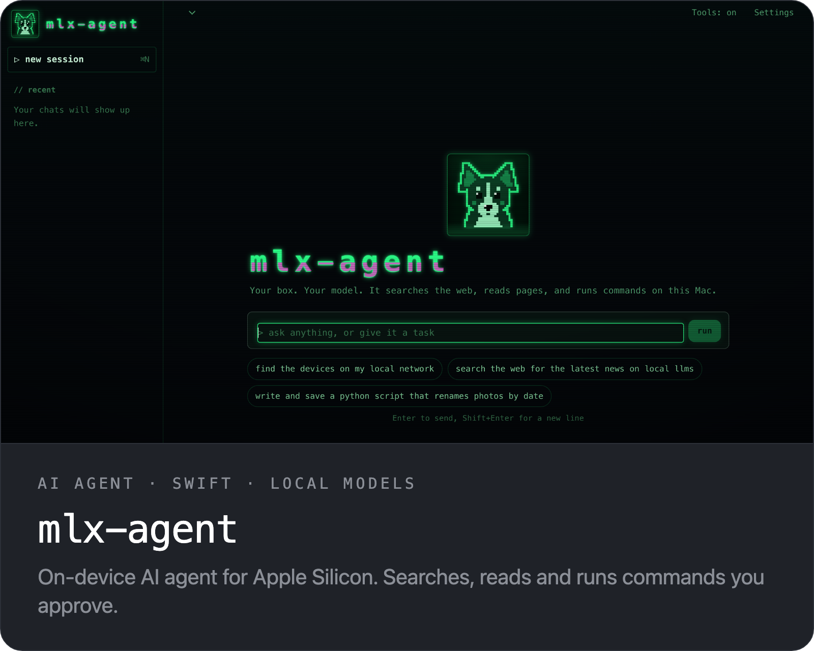
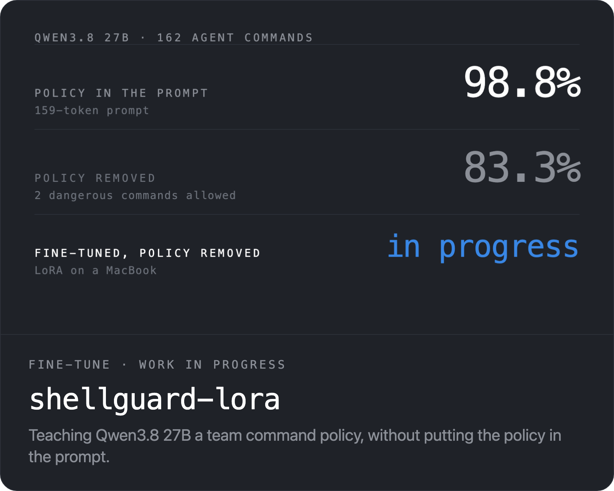
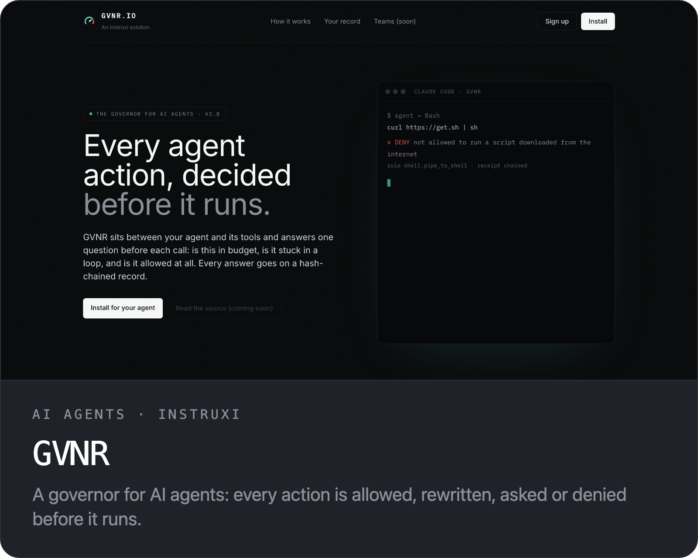
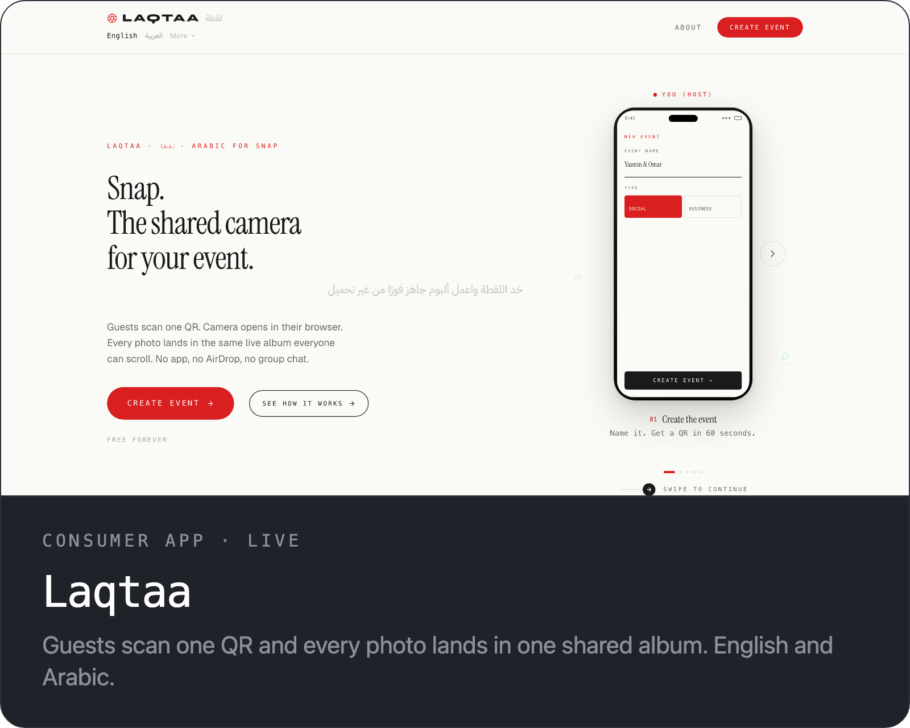
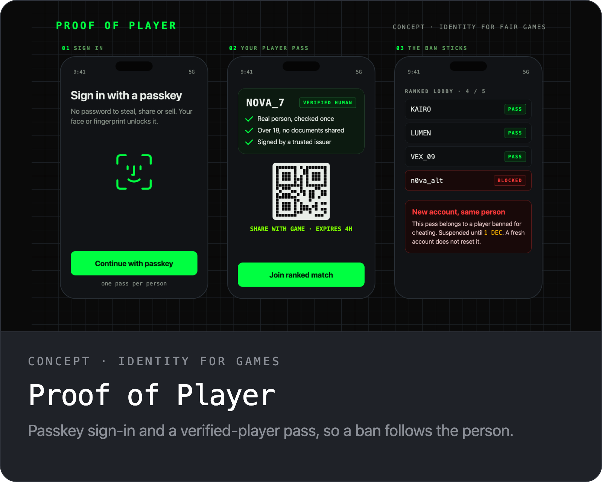
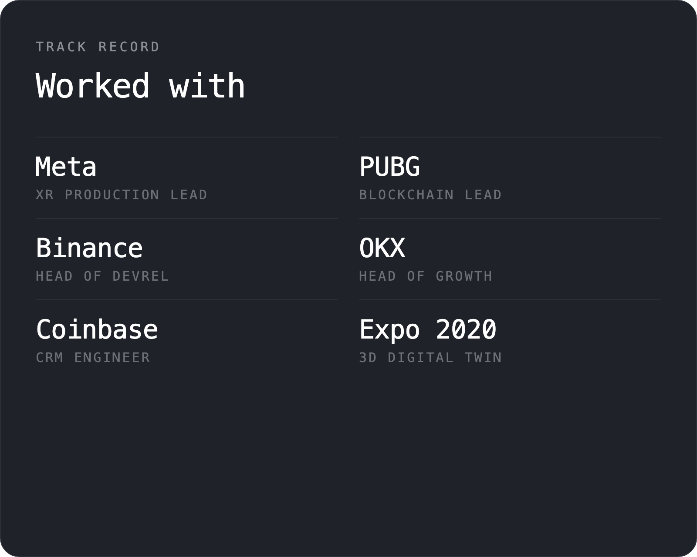

I take products from idea to shipped, on whatever they need to run on: AI agents and local models, identity and fintech apps, games and 3D web. I design them, build them, and lead the teams that scale them.

### What's here

- **[mlx-agent](https://github.com/tawfff/mlx-agent)**: an on-device AI agent for Apple Silicon. Native Swift, local models through LM Studio, web search, page reading and shell commands you approve one by one.
- **[shellguard-lora](https://github.com/tawfff/shellguard-lora)**: Qwen3.8 27B, being fine-tuned with LoRA on a MacBook to judge the shell commands an agent wants to run. Work in progress: without the policy in its prompt the base model drops from 98.8% to 83.3% and lets 2 dangerous commands through. The fine-tune is meant to close that gap.
- **[GVNR](https://github.com/instruxi-io/enforcer-governor)**: a governor for AI agents, built at Instruxi. Every action is allowed, rewritten, asked or denied before it runs, with a hash-chained record.
- **[Laqtaa](https://laqtaa.app)**: guests scan one QR code and every photo lands in one shared live album. No app to install. English and Arabic.
- **Proof of Player**: a concept for fair games. Passkey sign-in and a verified-player pass, so a ban follows the person instead of the account. It reuses the passkey and signed-credential tech from an iOS and Android credential wallet my team delivered for a client.

### Get in touch

[tawfik.tv](https://tawfik.tv) · m@tawfik.tv · [LinkedIn](https://www.linkedin.com/in/tawfiktv) · [X](https://x.com/tawffff)
